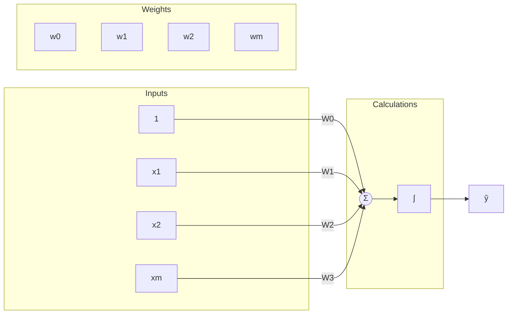
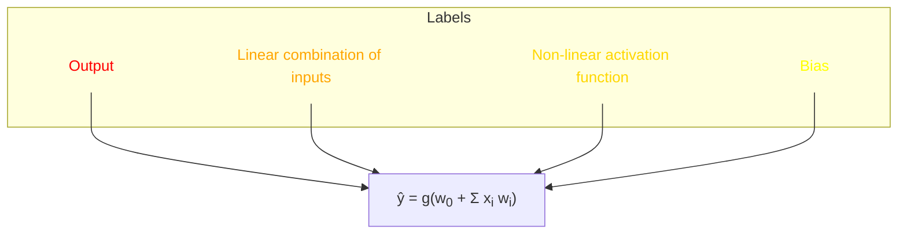

# Lecture 1
<table>
  <tr> <td>AI</td> <td>Techniques that enables computers to mimic human behaviour</td>
  </tr>
  <tr>
  <tr> <td></td> <td>WHY? To process info & inform future decisions</td>
  </tr>
  <tr>
    <td>ML</td> <td>The ability to learn w/o explicitly being programmed</td>
  </tr>
  <tr>
  <tr> <td></td> <td>WHY? How to do &#x2191; from the data</td>
  </tr>
  <tr>
    <td>DL</td>
    <td>Extract patterns from data using NN</td>
    <tr>
  <tr> <td></td> <td>WHY? Doing &#x2191; using NN</td>
  </tr>
  </tr>
</table>

### Why we need DL?
---
To shift from hand-engineered features to learning from raw pieces of data.
### Why now?
---
1. Big data: pervasive, abundancy
2. hardware: GPUs; capable of running parallel processing strams of info- particularly amenable in DL algorithms (parallelizable)
3. Software: Opensource tools those are used as the fundamental building blocks and the deplyment of all the underlying models (Keraas, TensorFlow)
### What is the fundamental building block of Neural Networks?
---
Perceptrons; single neurons

* They compute info themselves
* How they connect to these much larger billionth parameters of neural network
### What is the forward propagation process?
---
Multiply&#x2192;Add&#x2192;Activation Function&#x2192;final output(y)

> One neuron can ingest multiple inputs. The weights are being assigned to the input, they are a part of the neuron itself. 
### What is the Bias term?
---
It allows the neuron to shoft its activation function horizontally in the x axis.
### The Neural Network visuals



$$
\hat{y} = g(w_0 + X^T W)
$$

where: 

$$
X = \begin{bmatrix}
x_1 \\
\vdots \\
x_m
\end{bmatrix}
\text{ and }
W = \begin{bmatrix}
w_1 \\
\vdots \\
w_m
\end{bmatrix}
$$

## What is an activation function?

Its a non linear function. 
### Sigmoid Function
This function takes any real number as input (x axis), and squashes it to output between 0 to 1 (y axis). Its very popular to use in the probability dustribution.  <div style="display: flex; justify-content: center; align-items: center; height: 200px;">
  <svg width="300" height="200" xmlns="http://www.w3.org/2000/svg">
    <!-- Background grid lines -->
    <line x1="150" y1="0" x2="150" y2="200" stroke="#ddd" stroke-width="1"/>
    <line x1="0" y1="100" x2="300" y2="100" stroke="#ddd" stroke-width="1"/>
    <!-- Sigmoid path -->
    <path d="M 0 180 Q 100 100, 150 50 Q 200 0, 300 20" stroke="gold" fill="transparent" stroke-width="2"/>
  </svg>
</div>
The sigmoid function, is defined as:

$$
g(z) = \sigma(z) = \frac{1}{1 + e^{-z}}
$$

<a href="https://imgbb.com/"></a>
<a href="https://imgbb.com/"></a>

**TensorFlow Activation Functions**

* **`tf.math.sigmoid(z)`**

* **`tf.math.tanh(z)`**

* **`tf.nn.relu(z)`**
This is the Rectified Linear Unit function. Its linear, except there's a nonlinearity at x=0. (a step or a break discontinuity). Its just two piecewise function linearly ombined with each other. Its very easy to compute, very fast
### Why we are imposing nonlieanrity?
The world is extremely non linear and such that we want our models to be able to deal with the nonlinearity. One single line can't efficiently segregate a chaotic data field.

We have: 
$$
\begin{aligned}
\hat{y} &= g(w_0 + X^T W) \\
&= g \left( 1 + 
\begin{bmatrix}
x_1 \\
x_2
\end{bmatrix}^T
\begin{bmatrix}
3 \\
-2
\end{bmatrix} \right) \\
\hat{y} &= g(1 + 3x_1 - 2x_2)
\end{aligned}
$$
This is a 2D line in the Cartesean plane.
If we give the neuron a new data point, then upon plotting that on the 2D plane, we can see whats the answer is going to be, or the sign of that, what the answer itself is going to be. This is a FEATURE SPACE.
> The sigmoid function divides the space into two parts squashing everything between 0 and 1. In other words, it implicitly divides into les/greater than 0.5.
## How to build a Neural Network from perceptrons?
## Neural Network Layer Representation
## Neural Network Layer Representation
```mermaid
graph LR
    subgraph "Input Layer"
        x1((x1))
        x2((x2))
        xm((xm))
    end
    
    subgraph "Hidden Layer"
        z1((z1))
        z2((z2))
    end
    
    subgraph "Output Layer"
        y1((y1))
        y2((y2))
    end
    
    x1 --> z1
    x1 --> z2
    x2 --> z1
    x2 --> z2
    xm --> z1
    xm --> z2
    z1 --> y1
    z2 --> y2

    %% Adding notes to illustrate labels
    z1:::note1
    z2:::note2

    classDef note1 fill:,stroke:#333,stroke-width:2px;
    classDef note2 fill:,stroke:#333,stroke-width:2px;

    class z1 note1
    class z2 note2
  ```

The 2 neurons here, each sees all the inputs that came before it. Each has its own weights (lines). They are independent of each other, but if given another layer, they can communicate.
